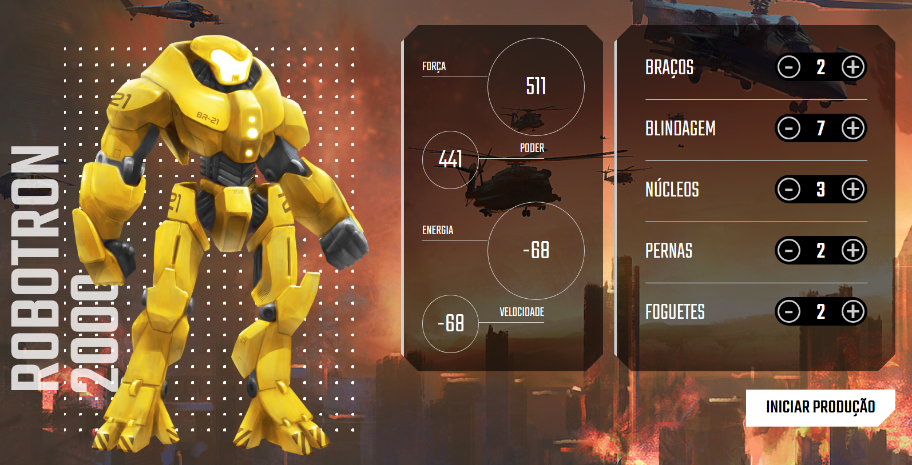

# Robotron-2000

> - Alura em JavaScript: Manipulando o DOM 

### Projeto realizado durante aula do curso Javascript: manipulando o DOM pela Alura.
 

[ Clique aqui para acessar ](https://reissjoao.github.io/Robotron-2000/)
 
 
## - Tecnologias 

- HTML
- CSS
- JavaScript 
    - forEach
    - Manipulação de dados
    - Function 